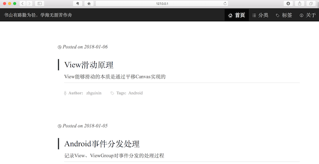
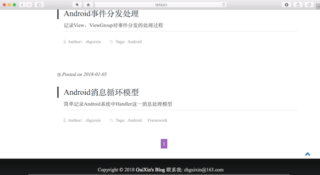
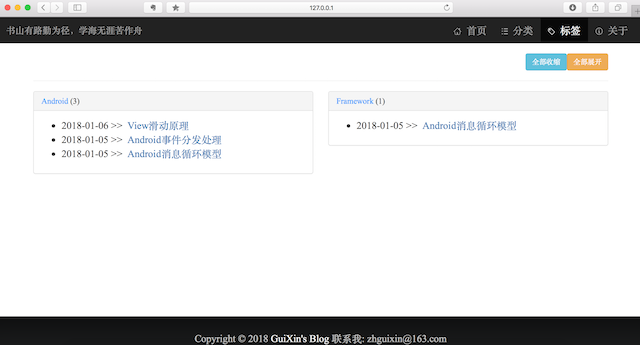

# myBlog
基于**Python2.7 + Django1.9**的博客系统，开发环境为**Eclipse+PyDev**。

- 博客导航条：首页、分类、标签、关于；
- 支持MarkDown渲染，支持代码高亮，文章目录自动生成，移动端自动隐藏侧栏目录，提升阅读体验；
- 支持文章评论、文章分享功能；
- 引入Bootstrap前端框架，支持响应式布局，移动端也能完美支持；
- 其他小功能：自动返回顶部、分页功能、RSS订阅、标签Tab可点击折叠、标签云。

*博客风格参考这位大神的[博客](http://qiangbo.space)*

#### 使用方法：

```bash
1、git clone https://github.com/zhguixin/myBlog.git # git clone到本地
2、virtualenv --python=python2 env # 创建本地虚拟环境，指定版本为Python2
3、source env/bin/activate # 激活虚拟环境
4、pip install -r requirements.txt # 安装依赖的第三方库
##### 进入myBlog目录，以下在myBlog目录下操作 #####
5、python manage.py makemigrations 
   python manage.py migrate 	# 这两句话的作用是生成数据库表以及sqlite数据库
6、python manage.py createsuperuser # 生成管理员用户，方便登入后台管理
7、python manage.py runserver # 默认服务在127.0.0.1:8080，在浏览器输入即可查看
```

*后台管理登入方式，在浏览器输入：**127.0.0.1/admin/**，用户名和密码即为创建管理员用户是创建的用户名和密码。*

##### 本地开发环境选择

开发环境可以选择Eclipse+[PyDev](http://www.pydev.org)插件的方式，也可以直接使用[PyCharm IDE](https://www.jetbrains.com/pycharm/)。

#### 基本效果展示

##### 首页



##### 首页底部页面：分页、返回顶部按钮、页脚



##### 标签页


