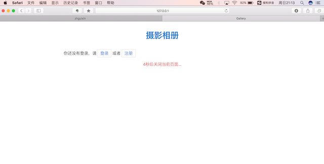
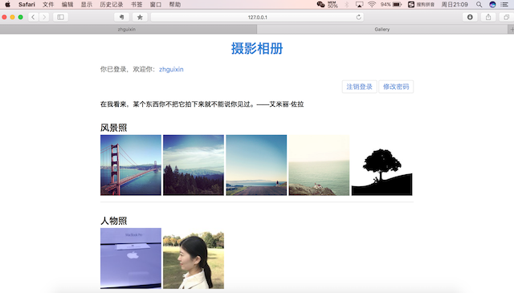

# myGallery
基于**Python2.7 + Django1.9**的相册墙，开发环境为**Eclipse+PyDev**。

- 用户登录后才可查看，支持新用户注册以及登录用户重置密码；
- 引入[Mobi.css](http://getmobicss.com/docs/introduction.html)样式框架，支持移动端设备查看；
- 引入[LightBox.js](http://lokeshdhakar.com/projects/lightbox2/)前端框架，支持相册分组展示，点击缩略图后弹出遮罩层前后浏览；
- 引入[LayLoad.js](https://www.w3cways.com/1765.html)，支持照片懒加载，提高页面访问速度；
- Django做后台上传处理，并且支持按需求压缩生成缩略图，节省用户空间和页面访问流量，由[easy_thumbanils](https://pypi.python.org/pypi/easy-thumbnails)支持产生缩略图。

##### 用户可以选择登录或者注册，否则5秒后自动关闭当前页面

##### 用户登录后的界面，可以查看到完整相册

以上。